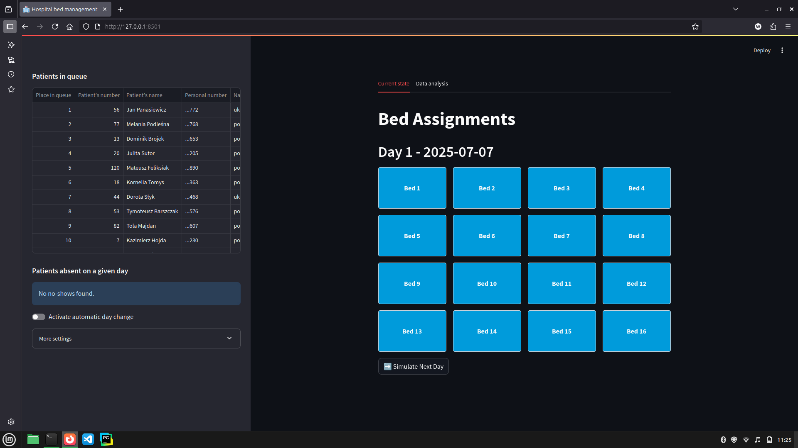

# bed-occupancy
An app that optimizes hospital resource management by simulating patient admissions, bed allocations, and managing no-shows effectively. Ideal for predictive occupancy planning and streamlined departmental coordination

## Table of contents
- [bed-occupancy](#bed-occupancy)
  - [Table of contents](#table-of-contents)
  - [Technologies](#technologies)
  - [Setup](#setup)
    - [Prerequisites](#prerequisites)
      - [Docker](#docker)
      - [Twilio](#twilio)
      - [Elevenlabs](#elevenlabs)
    - [How to run?](#how-to-run)
  - [Screenshots](#screenshots)
  - [Status](#status)
  - [Our team](#our-team)

## Technologies

- [Python](https://www.python.org/downloads/) _version: 3.13_, and its libraries:
  - [streamlit](https://docs.streamlit.io/) _version: 1.41.1_
  - [pydantic](https://docs.pydantic.dev/latest/) _version: 2.11.4_
  - [pandas](https://pandas.pydata.org/) _version: 2.2.3_
  - [fastapi](https://fastapi.tiangolo.com/) _version: 0.115.12_
  - and many other less important modules listed [here](./requirements.txt)
- [Docker](https://docs.docker.com/) _version: 27.4_
- [PostgreSQL](https://www.postgresql.org.pl/)
- [Twilio](https://www.twilio.com/en-us) for phone calls
- [ElevenLabs](https://elevenlabs.io/) for voice agents

## Setup

### Prerequisites

- Docker
- Twilio account
  - phone number for outbound calls
- Elevenlabs account
  - at least one voice agent (conversational_ai)
  - phone number connected to twilio

#### Docker

In order to run this app, docker is required.

If you don't have docker installed on your computer yet, you can install it [here](https://docs.docker.com/get-started/get-docker/)

#### Twilio

You can find out how to do that [here](https://www.google.com/search?client=firefox-b-lm&channel=entpr&q=how+to+setup+twilio+account+with+outbound+phone+number)

#### Elevenlabs

You can find out how to do that [here](https://www.google.com/search?q=how+to+setup+elevenlabs+account+with+conversational+ai+agent+and+twilio+phone+number&client=firefox-b-lm&sca_esv=9c54605068baa6ec&channel=entpr&sxsrf=AE3TifOo2jSdKmjgfoYNR7QXnnWndeeArg%3A1751879912994&ei=6JBraNOxPPv-wPAPwemTwAI&ved=0ahUKEwjTxZyftaqOAxV7PxAIHcH0BCgQ4dUDCBA&uact=5&oq=how+to+setup+elevenlabs+account+with+conversational+ai+agent+and+twilio+phone+number&gs_lp=Egxnd3Mtd2l6LXNlcnAiVGhvdyB0byBzZXR1cCBlbGV2ZW5sYWJzIGFjY291bnQgd2l0aCBjb252ZXJzYXRpb25hbCBhaSBhZ2VudCBhbmQgdHdpbGlvIHBob25lIG51bWJlcjIEECEYCkihiAZQ9doEWK2HBnAHeAGQAQCYAYsBoAHqKqoBBTMzLjI0uAEDyAEA-AEBmAImoAKKHsICChAAGLADGNYEGEfCAgUQABjvBcICBRAhGKABwgIEECEYFcICBxAhGKABGAqYAwCIBgGQBgiSBwUxMC4yOKAHpacBsgcENS4yOLgHkh3CBwkyLTE3LjE5LjLIB-EC&sclient=gws-wiz-serp)

### How to run?

Once you have docker installed, follow these guidelines:
1. Clone the repo on your local machine
   1. You can do it by running this command in terminal:
        ```
        git clone https://github.com/datarabbit-ai/bed-occupancy
        cd bed-occupancy
        ```
2. Prepare the `.env` file, it should be placed in the project's root folder

    It should contain variables like this:
    ```
    POSTGRES_NAME=postgres
    POSTGRES_USERNAME=postgres
    POSTGRES_PASSWORD=postgres
    POSTGRES_HOST=db
    POSTGRES_PORT=5432
    ELEVENLABS_API_KEY=your_api_key_to_elevenlabs
    AGENT_ID=polish_voice_agent_id
    AGENT_UA_ID=ukrainian_voice_agent_id
    AGENT_PHONE_NUMBER_ID=phone_number_id_from_elevenlabs
    TWILIO_SID=your_twilio_sid
    TWILIO_AUTH_TOKEN=your_twilio_auth_token
    ```

3. Make sure you are in the project's root folder and run the command:
   1.
    ```
    docker compose up
    ```
    There are two versions of this command: `docker-compose up` and `docker compose up`. The command `docker compose up` forces docker to use `docker_compose_v2` which is just better, more stable and more reliable.
   1. By running the above command, docker should:
     - launch faker, which will allow you to create a database and/or fill it with data
     - launch the backend and frontend of the application, allowing the browser to open the application, view data from the database and simulate the other day's hospital occupancy rates
   2. The whole process could take **even a few minutes**, especially when running for the first time
4. If you see in docker logs that frontend container is starting to run, you can [visit the webapp in browser](http://localhost:8501)

## Screenshots

Correctly set up and working app looks like this:


## Status

The project is: _in development_

## Our team

[Rumeleq](https://github.com/Rumeleq)

[wiktorKycia](https://github.com/wiktorKycia)

[JanTopolewski](https://github.com/JanTopolewski)
